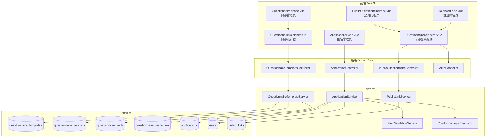

# 设计文档：动态问卷报名系统

## 概述

本设计基于现有的 Spring Boot + Vue 3 项目，扩展和修复问卷报名系统。核心工作包括：

1. **修复问卷设计器保存 bug**：QuestionnairesPage.vue 未处理 QuestionnaireDesigner.vue 的 `@save` 事件，导致保存按钮无效
2. **完善注册报名入口**：在 RegisterPage.vue 中集成动态问卷渲染，替换当前的占位区域
3. **完善公开链接报名入口**：增强 PublicQuestionnairePage.vue 的问卷渲染和提交流程
4. **增强报名列表**：在 ApplicationsPage.vue 中添加多条件筛选和分页功能

系统遵循现有的 Controller → Service → Repository 分层架构，前端使用 Vue 3 Composition API + Element Plus。

## 架构



## 组件与接口

### 1. QuestionnaireRenderer（新建前端组件）

通用问卷渲染组件，供注册页和公开问卷页复用。

```typescript
// frontend/src/components/questionnaire/QuestionnaireRenderer.vue
interface Props {
  schema: QuestionnaireSchema    // 问卷结构定义
  readonly?: boolean             // 是否只读模式
}

interface Emits {
  submit: [answers: Record<string, unknown>]  // 提交问卷回答
}

// 内部状态
// answers: Record<string, unknown>  — 用户填写的答案
// errors: Record<string, string>    — 字段校验错误信息
// visibleFields: ComputedRef<QuestionnaireField[]> — 根据条件逻辑计算的可见字段
```

组件职责：
- 根据 schema 动态渲染字段（按分组排序）
- 实时评估条件逻辑，控制字段显示/隐藏
- 提交前校验所有可见必填字段
- 通过 `submit` 事件向父组件传递校验通过的答案

### 2. QuestionnairesPage 修复（修改现有文件）

修复保存按钮不工作的 bug：

```typescript
// frontend/src/views/QuestionnairesPage.vue
// 当前问题：<QuestionnaireDesigner /> 没有处理 @save 事件
// 修复方案：
// 1. 添加 ref 引用 QuestionnaireDesigner 实例
// 2. 监听 @save 事件，调用 API 保存当前 schema
// 3. 监听 @publish 事件，调用 API 发布版本
// 4. 页面加载时获取模板列表，选择模板后加载版本数据

// 新增状态
// templateList: Ref<TemplateDTO[]>
// selectedTemplateId: Ref<number | null>
// designerRef: Ref<InstanceType<typeof QuestionnaireDesigner>>

// 新增方法
// loadTemplates(): 加载模板列表
// selectTemplate(id): 选择模板并加载版本数据到设计器
// handleSave(): 获取设计器当前 schema，调用 updateTemplate API
// handlePublish(): 调用 publishVersion API
```

### 3. ApplicationController 增强（修改现有文件）

添加分页和筛选查询接口：

```java
// 新增接口：分页筛选查询
@GetMapping("/page")
public ApiResponse<Page<ApplicationListItemDTO>> listByPage(
    @RequestParam(defaultValue = "0") int page,
    @RequestParam(defaultValue = "20") int size,
    @RequestParam(required = false) ApplicationStatus status,
    @RequestParam(required = false) Integer minAge,
    @RequestParam(required = false) Integer maxAge,
    @RequestParam(required = false) EducationStage educationStage,
    @RequestParam(required = false) Boolean examFlag,
    @RequestParam(required = false) ExamType examType
);
```

### 4. ApplicationService 增强（修改现有文件）

添加分页筛选查询方法：

```java
// ApplicationService 接口新增
Page<ApplicationListItemDTO> listByPage(
    int page, int size,
    ApplicationStatus status,
    Integer minAge, Integer maxAge,
    EducationStage educationStage,
    Boolean examFlag, ExamType examType
);
```

### 5. ApplicationRepository 增强（修改现有文件）

使用 Spring Data JPA Specification 实现动态查询：

```java
// ApplicationRepository 继承 JpaSpecificationExecutor
public interface ApplicationRepository extends
    JpaRepository<Application, Long>,
    JpaSpecificationExecutor<Application> {
}

// ApplicationSpecification 工具类（新建）
// 构建动态查询条件：status、age range、educationStage、examFlag、examType
```

### 6. AuthController 增强（修改现有文件）

注册接口需要支持同时提交问卷回答：

```java
// RegisterRequest DTO 新增字段
// questionnaireAnswers: Map<String, Object>  — 问卷回答数据

// AuthService.register() 增强逻辑：
// 1. 创建用户（APPLICANT, enabled=false）
// 2. 获取活跃问卷版本
// 3. 校验问卷回答（FieldValidationService + ConditionalLogicEvaluator）
// 4. 保存 QuestionnaireResponse
// 5. 创建 Application（PENDING_INITIAL_REVIEW）
```

## 数据模型

### 现有实体（无需修改）

| 实体 | 说明 |
|------|------|
| QuestionnaireTemplate | 问卷模板，含 title、description、activeVersionId |
| QuestionnaireVersion | 问卷版本，含 schemaDefinition（JSON）、status（DRAFT/PUBLISHED） |
| QuestionnaireField | 问卷字段，含 fieldType、label、required、validationRules、conditionalLogic |
| QuestionnaireResponse | 问卷回答，含 answers（JSON）、versionId、userId |
| Application | 报名申请，含 status、entryType、questionnaireResponseId |
| User | 用户，含 role、enabled |
| PublicLink | 公开链接，含 linkToken、versionId |

### QuestionnaireSchema JSON 结构

```json
{
  "groups": [
    { "name": "基本信息", "sortOrder": 0, "fields": ["field_1", "field_2"] }
  ],
  "fields": [
    {
      "key": "field_1",
      "type": "TEXT",
      "label": "姓名",
      "required": true,
      "validationRules": { "minLength": 2, "maxLength": 20 },
      "conditionalLogic": null,
      "options": null
    },
    {
      "key": "field_2",
      "type": "SINGLE_CHOICE",
      "label": "性别",
      "required": true,
      "validationRules": null,
      "conditionalLogic": null,
      "options": [
        { "value": "male", "label": "男" },
        { "value": "female", "label": "女" }
      ]
    }
  ]
}
```

### ApplicationListItemDTO（新建）

```java
public class ApplicationListItemDTO {
    private Long id;
    private Long userId;
    private String username;           // 关联 User.username
    private ApplicationStatus status;
    private EntryType entryType;
    private String pollenUid;
    private Integer calculatedAge;
    private EducationStage educationStage;
    private Boolean examFlag;
    private ExamType examType;
    private Boolean needsAttention;
    private LocalDateTime createdAt;
}
```

### ApplicationSpecification（新建）

```java
public class ApplicationSpecification {
    public static Specification<Application> withFilters(
        ApplicationStatus status,
        Integer minAge, Integer maxAge,
        EducationStage educationStage,
        Boolean examFlag, ExamType examType
    ) {
        return (root, query, cb) -> {
            List<Predicate> predicates = new ArrayList<>();
            if (status != null) predicates.add(cb.equal(root.get("status"), status));
            if (minAge != null) predicates.add(cb.greaterThanOrEqualTo(root.get("calculatedAge"), minAge));
            if (maxAge != null) predicates.add(cb.lessThanOrEqualTo(root.get("calculatedAge"), maxAge));
            if (educationStage != null) predicates.add(cb.equal(root.get("educationStage"), educationStage));
            if (examFlag != null) predicates.add(cb.equal(root.get("examFlag"), examFlag));
            if (examType != null) predicates.add(cb.equal(root.get("examType"), examType));
            return cb.and(predicates.toArray(new Predicate[0]));
        };
    }
}
```


## 正确性属性

*正确性属性是系统在所有合法执行中应保持为真的特征或行为——本质上是关于系统应该做什么的形式化陈述。属性是人类可读规范与机器可验证正确性保证之间的桥梁。*

### Property 1: QuestionnaireSchema 序列化往返一致性

*For any* 合法的 QuestionnaireSchema 对象（包含任意数量的 groups 和 fields，fields 可包含任意合法的 validationRules、conditionalLogic 和 options），将其序列化为 JSON 字符串后再反序列化，应产生与原始对象等价的结果。

**Validates: Requirements 4.1, 4.2, 4.3**

### Property 2: 条件逻辑可见性计算

*For any* 条件逻辑配置（action 为 SHOW 或 HIDE）和任意用户回答集合，字段可见性应满足：`visible = (action == "SHOW") == conditionsMet`。即 SHOW 动作下条件满足则可见，HIDE 动作下条件满足则隐藏。

**Validates: Requirements 9.1, 9.2, 9.3, 9.4**

### Property 3: 条件逻辑 AND/OR 运算符

*For any* 条件集合和用户回答，当逻辑运算符为 AND 时，条件满足当且仅当所有单个条件均满足；当逻辑运算符为 OR 时，条件满足当且仅当至少一个条件满足。

**Validates: Requirements 9.5, 9.6**

### Property 4: 字段校验引擎正确性

*For any* 字段配置（含 fieldType、required、validationRules）和任意输入值：
- 若字段为必填且值为空（null/空字符串/空集合），校验应返回错误
- 若字段有 minLength/maxLength 规则，校验结果应正确反映字符串长度是否在范围内
- 若字段有 min/max 规则，校验结果应正确反映数值是否在范围内
- 若字段有 minDate/maxDate 规则，校验结果应正确反映日期是否在范围内
- 若字段有 minSelect/maxSelect 规则，校验结果应正确反映选择数量是否在范围内

**Validates: Requirements 8.1, 8.2, 8.3, 8.4, 8.5**

### Property 5: 报名创建不变量

*For any* 通过注册入口或公开链接入口成功创建的报名申请，以下不变量应成立：
- 关联的用户角色为 APPLICANT
- 关联的用户账号状态为禁用（enabled = false）
- 报名申请状态为 PENDING_INITIAL_REVIEW
- 报名申请关联了有效的 QuestionnaireResponse

**Validates: Requirements 6.1, 7.2**

### Property 6: 初审状态转换一致性

*For any* 处于 PENDING_INITIAL_REVIEW 状态的报名申请：
- 若审核决定为通过，则申请状态应变为 INITIAL_REVIEW_PASSED 且用户账号应被启用
- 若审核决定为拒绝，则申请状态应变为 REJECTED 且用户账号应保持禁用

**Validates: Requirements 10.1, 10.2**

### Property 7: 报名列表筛选正确性

*For any* 筛选条件组合（status、minAge、maxAge、educationStage、examFlag、examType）和任意报名数据集，筛选结果中的每条记录应同时满足所有指定的筛选条件（交集语义）。

**Validates: Requirements 11.2, 11.3, 11.4, 11.5, 11.7**

### Property 8: 报名列表时间排序

*For any* 报名列表查询结果，记录应按 createdAt 降序排列，即对于结果中任意相邻的两条记录，前一条的 createdAt 应大于或等于后一条的 createdAt。

**Validates: Requirements 11.1**

### Property 9: 版本历史排序

*For any* 问卷模板的版本历史查询结果，版本应按 versionNumber 降序排列。

**Validates: Requirements 1.3**

### Property 10: 问卷字段按分组排序渲染

*For any* QuestionnaireSchema，渲染时字段应按所属分组的 sortOrder 排序展示，未分配到任何分组的字段应排列在所有分组字段之后。

**Validates: Requirements 3.3**

### Property 11: 问卷模板访问控制

*For any* 用户和角色组合，访问问卷模板管理接口的结果应满足：角色为 ADMIN、LEADER 或 VICE_LEADER 时允许访问，其他角色返回 403。

**Validates: Requirements 5.1, 5.2**

### Property 12: 仅校验可见必填字段

*For any* QuestionnaireSchema 和用户回答集合，提交校验应仅对条件逻辑评估为可见且标记为必填的字段执行必填校验，对隐藏字段不执行校验。

**Validates: Requirements 6.4**

### Property 13: 分页大小约束

*For any* 分页查询请求（page、size），返回结果的记录数应不超过请求的 size 值。

**Validates: Requirements 11.6**

## 错误处理

| 场景 | 处理方式 |
|------|----------|
| 问卷保存失败（网络/服务端错误） | 前端显示 ElMessage.error，保留当前编辑状态 |
| 问卷 JSON 反序列化失败 | 后端返回 400 Bad Request，前端显示格式错误提示 |
| 公开链接过期或无效 | 后端返回 404/410，前端显示"链接已失效"提示页 |
| 注册时用户名已存在 | 后端返回 409 Conflict，前端显示用户名重复提示 |
| 问卷校验失败 | 前端高亮错误字段并显示具体错误信息，阻止提交 |
| 初审操作权限不足 | 后端返回 403 Forbidden（SecurityConfig 已配置） |
| 校验规则 JSON 格式无效 | FieldValidationService 跳过校验，视为通过 |
| 条件逻辑 JSON 格式无效 | ConditionalLogicEvaluator 默认返回字段可见 |
| 分页参数无效（负数页码） | 后端使用默认值（page=0, size=20） |

## 测试策略

### 单元测试

- **FieldValidationService**：测试各种字段类型和校验规则的边界情况
- **ConditionalLogicEvaluator**：测试各种操作符和逻辑组合的具体示例
- **ApplicationSpecification**：测试各种筛选条件组合生成的 Predicate
- **QuestionnaireRenderer.vue**：测试字段渲染、条件逻辑响应、校验错误显示
- **QuestionnairesPage.vue**：测试保存/发布事件处理（修复 bug 验证）

### 属性测试

使用 **jqwik**（Java 属性测试库）进行后端属性测试，使用 **fast-check**（TypeScript 属性测试库）进行前端属性测试。

每个属性测试配置最少 100 次迭代。

每个属性测试必须通过注释标注对应的设计文档属性编号：
- 标注格式：`Feature: questionnaire-registration, Property {N}: {属性标题}`

**后端属性测试（jqwik）**：
- Property 1: QuestionnaireSchema 序列化往返一致性
- Property 4: 字段校验引擎正确性
- Property 5: 报名创建不变量
- Property 6: 初审状态转换一致性
- Property 7: 报名列表筛选正确性
- Property 8: 报名列表时间排序
- Property 13: 分页大小约束

**前端属性测试（fast-check）**：
- Property 1: QuestionnaireSchema 序列化往返一致性（前端 JSON 处理）
- Property 2: 条件逻辑可见性计算
- Property 3: 条件逻辑 AND/OR 运算符
- Property 10: 问卷字段按分组排序渲染
- Property 12: 仅校验可见必填字段
